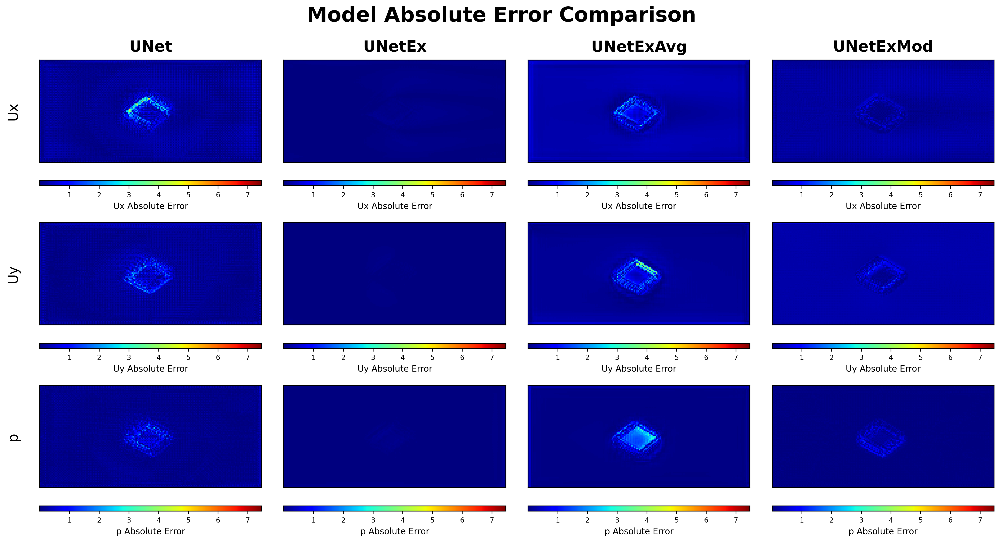
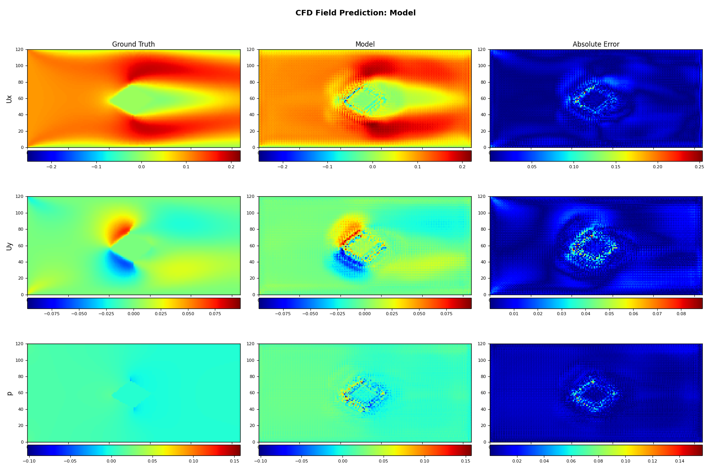

# DeepCFD+ 🌊⚡
[](https://www.python.org/) 
[](LICENSE)  

<p align="center">
  
</p>

> 💡 **Accelerating CFD simulations with deep learning: 1000x speedup, high accuracy, industrial-grade training framework, ready to use.**

DeepCFD+ is an engineering refactoring and enhanced version of [DeepCFD](https://github.com/mdribeiro/DeepCFD), specifically designed for **steady-state laminar Navier-Stokes equation solving**. Through CNN models, it directly learns velocity fields (Ux, Uy) and pressure field (p) from high-fidelity CFD data, achieving **over 1000x inference acceleration** while maintaining low error.

Applications:  
🔹 Aerodynamic shape optimization  
🔹 Fast flow field prediction  
🔹 Multi-scenario CFD surrogate modeling  
🔹 Research and industrial deep learning-CFD fusion projects

---

## 🚀 Core Advantages
| Feature | Description |
|---------|-------------|
| ⚡ **Lightning Fast Inference** | 100-1000x faster than traditional CFD solvers (e.g., simpleFOAM) |
| 🧠 **End-to-End Learning** | Direct mapping from SDF geometry input → full-field output (Ux, Uy, p) |
| 🔧 **Industrial-Grade Training** | Supports early stopping, checkpointing, dynamic learning rate, multi-metric monitoring, GPU auto-scheduling |
| 🧩 **Modular Architecture** | UNetEx / AutoEncoder / custom models, YAML configuration driven |
| 📊 **Built-in Visualization** | Automatically plots predictions vs ground truth fields, error heatmaps |
| 🔄 **Fully Reproducible** | Fixed random seeds + structured logging + config versioning |
| ⚙️ **YAML Configuration Driven** | Centralized management of all hyperparameters via a single YAML file, supporting flexible adjustment of model configurations and training parameters without code modification |

---

## 🛠️ Results Showcase
<p align="center">
  
</p>
<p align="center">
  
</p>

---

## 📦 Project Structure

```
DeepCFD+/
├── Models/              # Model definitions (UNet.py, UNetEx.py, AutoEncoder.py...)
├── Lib/                 # Core training logic (trainer, CFD utils, PyTorch helpers)
├── Data/                # Dataset directory (supports .pkl, compatible with original DeepCFD)
├── config.yaml          # Centralized hyperparameter configuration
├── main.py              # Entry point: one-command training
└── requirements.txt     # Python dependencies
```

---

## ⚙️ Configuration File Details

The project centrally manages all hyperparameters and configurations through the `config.yaml` file:

```yaml
# Data path configuration
data_path: './Data/'  # Data file directory

# Model configuration section
models:
  UNet:               # Model name
    lr: 0.001         # Learning rate
    batch_size: 64    # Batch size
    epochs: 1000      # Training epochs
    # More model-specific parameters...

# General training configuration
training:
  train_ratio: 0.7    # Training set ratio
```

**Advantages:**
- Adjust hyperparameters without modifying code
- Support configuring multiple models simultaneously
- Clear comments explaining the purpose of each parameter
- Unified management of training and model parameters

---

## 🧪 Quick Start

### 1. Install dependencies
```bash
pip install -r requirements.txt
```

### 2. Prepare data
Download the official toy dataset from [Zenodo](https://zenodo.org/record/3666056):
```bash
wget https://zenodo.org/record/3666056/files/DeepCFD.zip?download=1 -O DeepCFD.zip
unzip DeepCFD.zip
mv DeepCFD/dataX.pkl Data/
mv DeepCFD/dataY.pkl Data/
```

### 3. Start training
```bash
python main.py
```
By default, it loads `Data/dataX.pkl` / `Data/dataY.pkl`.

> ✅ Automatically saves checkpoints, logs metrics, and visualizes results.

---

## 🧩 Want to add your own model?

<details>
<summary>👉 Click to expand: Detailed model registration steps</summary>

Adding a custom model requires configuration in three places:

### 1. Create Model File
Create your model file in the `Models/` directory, for example `MyCustomModel.py`:

```python
import torch
import torch.nn as nn

class MyCustomModel(nn.Module):
    def __init__(self, in_channels, out_channels, **kwargs):
        super(MyCustomModel, self).__init__()
        # Implement your model structure
        self.model = nn.Sequential(
            nn.Conv2d(in_channels, 64, 3, padding=1),
            nn.ReLU(),
            nn.Conv2d(64, out_channels, 3, padding=1)
        )
        
    def forward(self, x):
        return self.model(x)
```

### 2. Register Model in main.py
Open `main.py` file and add in the model import section:

```python
# Import your model at the beginning of the file
from Models.MyCustomModel import MyCustomModel
```

Then add model configuration code in the `ModelTrainer.create_model()` method:

```python
elif self.model_name == "MyCustomModel":
    # Get configuration parameters
    lr = self.kwargs.get('lr', 0.001)
    batch_size = self.kwargs.get('batch_size', 64)
    
    # Create model instance
    self.model = MyCustomModel(3, 3)  # Adjust input/output channels as needed
    
    # Set optimizer
    self.optimizer = torch.optim.AdamW(self.model.parameters(), lr=lr)
    
    # Set loss function
    self.loss_func = self.unet_loss_func  # You can use existing or custom ones
    
    # Set training parameters
    self.batch_size = batch_size
```

### 3. Add Configuration in config.yaml
Add your model configuration in the `models` section of `config.yaml` file:

```yaml
models:
  MyCustomModel:
    lr: 0.001
    batch_size: 64
    epochs: 1000
    # Other model-specific parameters
```

### 4. Run Training
After completing the above steps, run `python main.py`, and the framework will automatically train your model based on the configuration file!

> 💡 Custom loss functions, metrics, and data preprocessing are fully supported (see `Lib/train_model.py`)

</details>

---

## 📚 Citation & Acknowledgements

This project builds upon:
- **DeepCFD**: [arXiv: 2004.08826](https://arxiv.org/abs/2004.08826)  
- **Dataset**: [Zenodo Record](https://zenodo.org/record/3666056)

If you use this in research, please cite the original paper.

---

## 📜 License

[LICENSE](LICENSE)