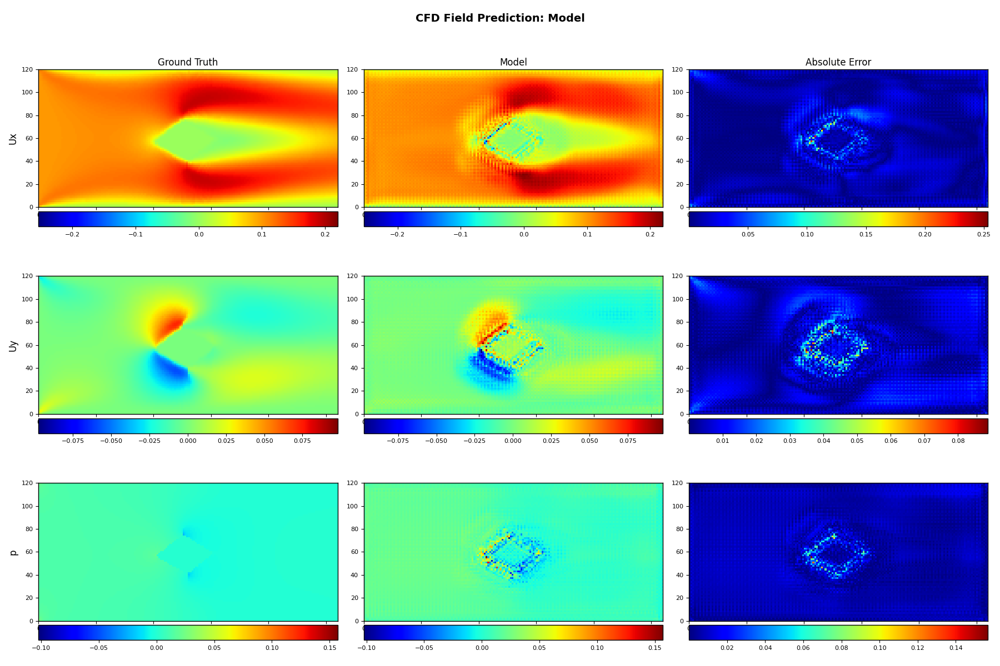

# DeepCFD+ 🌊⚡
[](https://www.python.org/) 
[](LICENSE)  

<p align="center">
  
</p>

> 💡 **用深度学习加速 CFD 仿真：千倍提速，高精度预测，工业级训练框架，开箱即用。**

DeepCFD+ 是对 [DeepCFD](https://github.com/mdribeiro/DeepCFD) 的工程化重构与增强版本，专为**稳态层流 Navier-Stokes 方程求解**设计。通过 CNN 模型直接从高保真 CFD 数据中学习速度场（Ux, Uy）与压力场（p），在保持低误差的同时，实现 **1000 倍以上的推理加速**。

适用于：  
🔹 气动外形优化  
🔹 快速流场预测  
🔹 多场景 CFD 代理建模  
🔹 科研与工业级深度学习-CFD 融合项目

---

## 🚀 核心优势
| 特性 | 说明 |
|------|------|
| ⚡ **极速推理** | 相比传统 CFD 求解器（如 simpleFOAM），推理快 100–1000 倍 |
| 🧠 **端到端学习** | 直接从 SDF 几何输入 → 输出 (Ux, Uy, p) 全场 |
| 🔧 **工业级训练** | 支持早停、检查点、动态学习率、多指标监控、GPU 自动调度 |
| 🧩 **模块化架构** | UNetEx / AutoEncoder / 自定义模型，YAML 配置驱动 |
| 📊 **可视化内置** | 自动绘制预测 vs 真实场、误差热力图 |
| 🔄 **完全可复现** | 固定随机种子 + 结构化日志 + 配置版本管理 |
| ⚙️ **YAML配置驱动** | 通过单一YAML文件集中管理所有超参数，支持灵活调整模型配置和训练参数，无需修改代码 |

---

## 🛠️ 效果展示
<p align="center">
  
</p>
<p align="center">
  
</p>

---

## 📦 项目结构

```
DeepCFD+/
├── Models/              # 模型定义（UNet.py, UNetEx.py, AutoEncoder.py...）
├── Lib/                 # 核心训练库（训练器、CFD 工具、PyTorch 辅助函数）
├── Data/                # 数据目录（支持 .pkl 格式，兼容 DeepCFD 原始数据集）
├── config.yaml          # 超参数集中配置（模型/训练/路径）
├── main.py              # 主入口：一键启动训练
└── requirements.txt     # 依赖清单
```

---

## ⚙️ 配置文件详解

项目通过 `config.yaml` 文件集中管理所有超参数和配置：

```yaml
# 数据路径配置
data_path: './Data/'  # 数据文件目录

# 模型配置部分
models:
  UNet:               # 模型名称
    lr: 0.001         # 学习率
    batch_size: 64    # 批次大小
    epochs: 1000      # 训练轮数
    # 更多模型特定参数...

# 训练通用配置
training:
  train_ratio: 0.7    # 训练集占比
```

**优势：**
- 无需修改代码即可调整超参数
- 支持同时配置多个模型
- 清晰的注释说明每个参数的作用
- 统一管理训练和模型参数

---

## 🧪 快速开始

### 1. 安装依赖
```bash
pip install -r requirements.txt
```

### 2. 准备数据
下载官方 toy dataset（来自 [Zenodo](https://zenodo.org/record/3666056)）：
```bash
wget https://zenodo.org/record/3666056/files/DeepCFD.zip?download=1 -O DeepCFD.zip
unzip DeepCFD.zip
mv DeepCFD/dataX.pkl Data/
mv DeepCFD/dataY.pkl Data/
```

### 3. 启动训练
```bash
python main.py
```
默认自动加载 `Data/dataX.pkl` 与 `Data/dataY.pkl`。

> ✅ 训练过程中会自动保存模型、绘制损失曲线、输出日志。

---

## 🧩 扩展你的模型？

<details>
<summary>👉 点击展开：详细模型注册步骤</summary>

添加自定义模型需要在三个地方进行配置：

### 1. 创建模型文件
在 `Models/` 目录下创建你的模型文件，例如 `MyCustomModel.py`：

```python
import torch
import torch.nn as nn

class MyCustomModel(nn.Module):
    def __init__(self, in_channels, out_channels, **kwargs):
        super(MyCustomModel, self).__init__()
        # 实现你的模型结构
        self.model = nn.Sequential(
            nn.Conv2d(in_channels, 64, 3, padding=1),
            nn.ReLU(),
            nn.Conv2d(64, out_channels, 3, padding=1)
        )
        
    def forward(self, x):
        return self.model(x)
```

### 2. 在 main.py 中注册模型
打开 `main.py` 文件，在模型导入部分添加：

```python
# 在文件开头导入你的模型
from Models.MyCustomModel import MyCustomModel
```

然后在 `ModelTrainer.create_model()` 方法中添加模型配置代码：

```python
elif self.model_name == "MyCustomModel":
    # 获取配置参数
    lr = self.kwargs.get('lr', 0.001)
    batch_size = self.kwargs.get('batch_size', 64)
    
    # 创建模型实例
    self.model = MyCustomModel(3, 3)  # 根据需要调整输入输出通道数
    
    # 设置优化器
    self.optimizer = torch.optim.AdamW(self.model.parameters(), lr=lr)
    
    # 设置损失函数
    self.loss_func = self.unet_loss_func  # 可以使用现有的或自定义的
    
    # 设置训练参数
    self.batch_size = batch_size
```

### 3. 在 config.yaml 中添加配置
在 `config.yaml` 文件的 `models` 部分添加你的模型配置：

```yaml
models:
  MyCustomModel:
    lr: 0.001
    batch_size: 64
    epochs: 1000
    # 其他模型特定参数
```

### 4. 运行训练
完成以上步骤后，运行 `python main.py`，框架会根据配置文件自动训练你的模型！

> 💡 支持自定义损失函数、指标、数据预处理逻辑（详见 `Lib/train_model.py`）

</details>

---

## 📚 引用与致谢

本项目基于以下工作：
- **DeepCFD**: [arXiv: 2004.08826](https://arxiv.org/abs/2004.08826)  
- 数据集来源: [Zenodo Record](https://zenodo.org/record/3666056)

如用于科研，请引用原始论文。

---

## 📜 许可证

 [LICENSE](LICENSE)